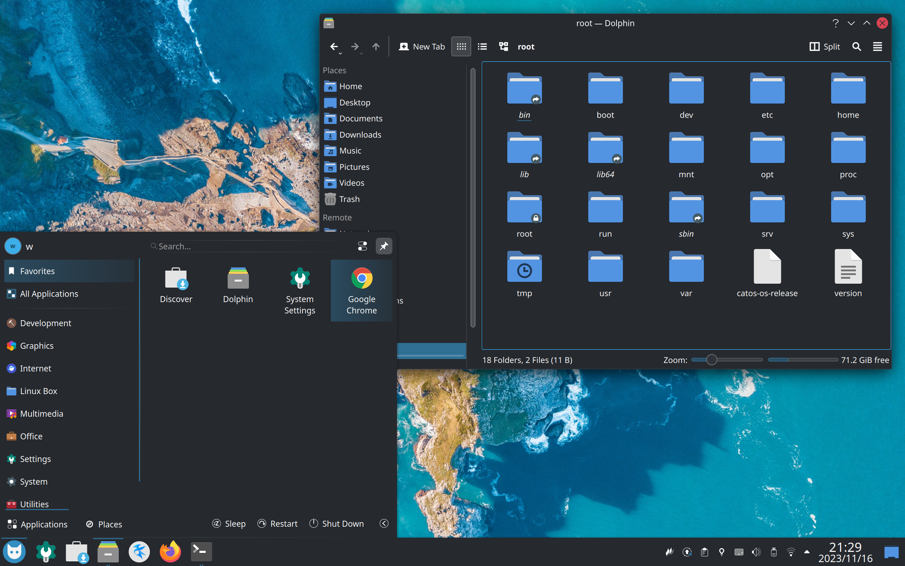
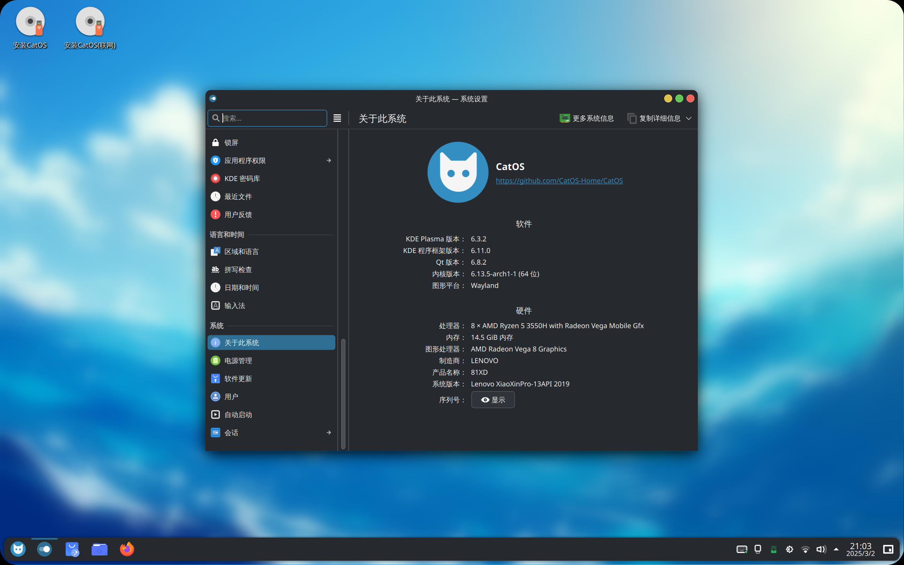
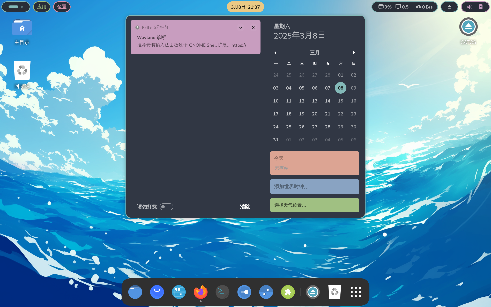
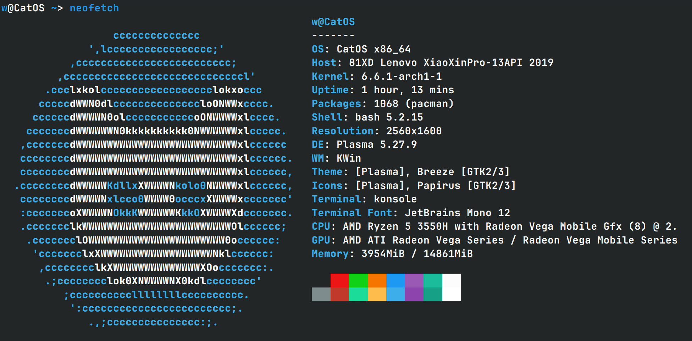

<h1 align="center">🚀 CatOS - Arch-Based, Out-of-the-Box Linux 🚀</h1>

[**简体中文**](README_zh_CN.md) |  [**English**](README.md)  |  [**Español**](README_ES.md) | [**日本語**](README_JP.md)

[**Overview**](#overview) |  [**Why CatOS?**](#why-catos)  |  [**Download**](#overview) | [**Installation**](#overview) | [**Feedback**](#overview)

## Overview

CatOS is an open-source, Arch-based, out-of-the-box Linux distribution designed to provide an excellent operating system user experience.

Arch is fast, stable, and secure and also allowing you to have a great experience even on older computers.However, Arch Linux is also aimed at more experienced users. As such, it is generally considered to be beyond the reach of those who need more technical expertise or persistence to use it. This is why CatOS was born, to inherit the advantages of arch while making it more user-friendly, so that you can enjoy it without complicated installation and configuration.

## Why CatOS?

### 📤 Out-of-the-box
Once the system is installed, everything is ready, including a well-designed desktop environment, software repositories(archlinuxcn,arch4edu), AUR helper, input method, GRUB theme, Nvdia GPU drivers and much more.

### 💻 Easy to install
CatOS use a customized version of Calamares graphical installer, making it available for even the least inexperienced users.

### 🐱 Linux Subsystem
CatOS supports more than ten Linux subsystems, including Ubuntu, CentOS, Red Hat, openSUSE, Deepin, Void, etc., all of which are deeply integrated and can be started with one click.

### 🆙 Usability
CatOS is designed to be user-friendly. We believe that anyone, regardless of their technical background, should be able to use and benefit from CatOS.

### 🚀 Speed and Reliability
Thanks to the excellent features of Arch Linux, CatOS is a lightweight system that runs smoothly and is stable and free from crashes.

## Download

**Eager to experience CatOS? Download the ISO image now and begin your journey!**

[**⬇️  Download CatOS ISO Image**](https://catos.info/en/docs/download)

*   Click the link above to be directed to the official CatOS download page.
*   On the download page, you can choose the latest CatOS version to download.
*   To ensure the integrity and security of your downloaded ISO image file, it is recommended to **[Verify the checksum of the ISO image file (SHA256 or others)]** after downloading. Checksum information can usually be found on the download page. 

## Installation

Ready to install CatOS? Our [**Installation Guide**](https://catos.info/en/docs/installation/installation00) will walk you through the process with ease.

## Feedback

CatOS is currently in the development phase. Please report issues you are experiencing and feel free to contact us if you have any problems.

## Star History

