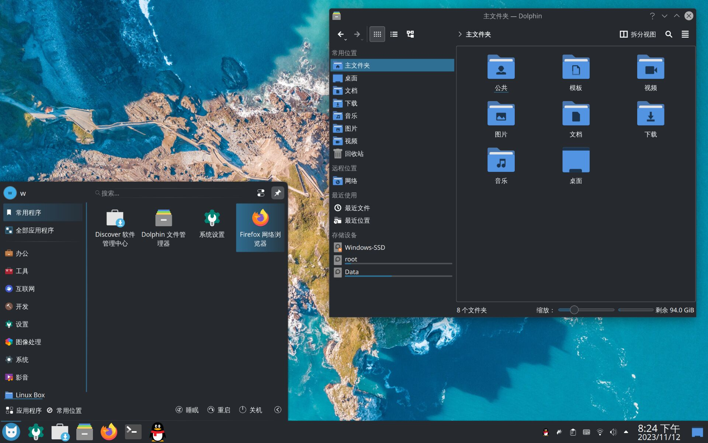
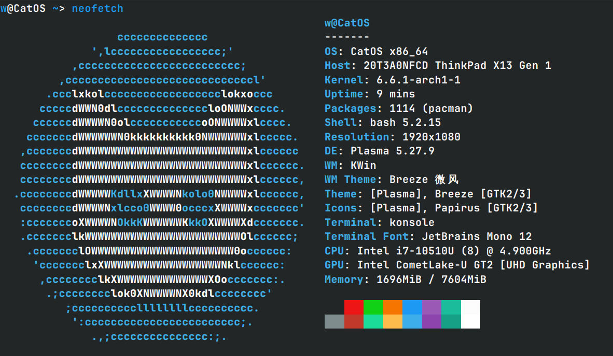

[简体中文](README_zh_CN.md)   [English](README.md)    [Español](README_ES.md)  [日本語](README_JP.md)

## 简介

CatOS是一个开源的、基于 Arch Linux的、开箱即用的Linux发行版，旨在提供出色的操作系统用户体验。

Arch是一个优秀的Linux发行版，快速、稳定、安全，即使是在老旧的计算机上也能有非常出色的体验。但是纯指令式的安装过程较为复杂，需要有较高的计算机基础，您需要为此付出足够的时间、精力和耐心，即使顺利安装完成，您还将面临安装图形界面、配置软件源、安装输入法、安装显卡驱动、安装AUR助手等一系列的配置过程，并不是每个人都有足够的时间、精力和耐心完全这一切，很多新手可能会被这一艰巨的过程阻挡在arch世界的大门之外。这正式CatOS诞生的理由，在继承arch优点的同时，使其安装简便、开箱即用、更加用户友好，无需复杂的安装和配置，您就可以领略到arch的魅力！

## 为什么选择CatOS?

### 📤 开箱即用
一旦系统安装完全,即是原生中文、开箱即用的状态，已为您配置好了美观的图形桌面环境、国内镜像源（包括archlinuxcn和arch4edu源）, AUR助手（yay）, i中文输入法, GRUB主题, 显卡驱动（包含N卡闭源驱动）等等，更加符合国人的使用环境。

### 💻 安装简便
CatOS使用了定制版的Calamares图形化安装程序, 一键安装、傻瓜式操作，就算您是完全没有经验的新手也能轻松完全安装过程。支持离线安装和在线安装两种模式，离线安装完全后与LiveCD完全相同，全程无需联网，只需不到三分钟即可安装完成。在线安装允许用户自行选择桌面环境和其他软件包，可轻松自定义属于您的Linux系统。

### 🐱 Linux子系统
CatOS支持包括Ubuntu, CentOS, Red Hat, openSUSE, Deepin, Void等在内的十余种Linux子系统,支持一键安装，轻松体验其他发行版的特色或者创建隔离的开发或者测试环境。

### 🆙 用户友好
CatOS旨在提供出色的操作系统用户体验，我们相信不管用户的技术背景如何, 都能轻松上手和享用CatOS。

### 🚀 快速稳定
得益于arch的优秀特性，CatOS是一个轻量、快速、稳定的系统。默认使用BTRFS文件系统、配合timeshift系统快照软件，使系统永不滚挂。

## 反馈

CatOS目前仍处于快速开发阶段，有任何问题请提交issues。或者加入官方QQ交流群（428382413），参与开发或者提供反馈意见，每一个意见我们都会认真对待并且给出回复，期待与您共同打造一款优秀的中文Linux发行版。

## Star History

